# Electronics Table
|File|Directory|Qty|Accent|LDO Version|Variations|
|---|---|---|---|---|---|
|<a href="Electronics Table/Cable Channel Cover x1.stl">Cable Channel Cover x1</a>|Electronics Table|1|False|||
|<a href="Electronics Table/Cable Channel x1.stl">Cable Channel x1</a>|Electronics Table|1|False|||
|<a href="Electronics Table/IO Expander DIN Mount  x1.stl">IO Expander DIN Mount  x1</a>|Electronics Table|1|False|||
|<a href="Electronics Table/IO Expander Mount  x1.stl">IO Expander Mount  x1</a>|Electronics Table|1|False|True||
|<a href="Electronics Table/Mainboard Mount x1.stl">Mainboard Mount x1</a>|Electronics Table|1|False|True||
|<a href="Electronics Table/PSU Mounting Brackets  x1.stl">PSU Mounting Brackets  x1</a>|Electronics Table|1|False|True||
|<a href="Electronics Table/Rear Skirt A x1.stl">Rear Skirt A x1</a>|Electronics Table|1|False|True||
|<a href="Electronics Table/Rear Skirt B x1.stl">Rear Skirt B x1</a>|Electronics Table|1|False|True||
|<a href="Electronics Table/Skirt Front A Solid x1.stl">Skirt Front A Solid x1</a>|Electronics Table|1|False|||
|<a href="Electronics Table/Skirt Front B E-Stop x1.stl">Skirt Front B E-Stop x1</a>|Electronics Table|1|False|||
|<a href="Electronics Table/TPU Feet x4.stl">TPU Feet x4</a>|Electronics Table|4|False|||
|<a href="Electronics Table/WAGO Mount Horizontal x1.stl">WAGO Mount Horizontal x1</a>|Electronics Table|1|False|True|True|
|<a href="Electronics Table/WAGO Mount Vertical x1.stl">WAGO Mount Vertical x1</a>|Electronics Table|1|False|True|True|
|<a href="Electronics Table/[a] Table Bolt Down Bracket A x2.stl">[a] Table Bolt Down Bracket A x2</a>|Electronics Table|2|True|||
|<a href="Electronics Table/[a] Table Bolt Down Bracket B x2.stl">[a] Table Bolt Down Bracket B x2</a>|Electronics Table|2|True|||
# Minimill Main
|File|Directory|Qty|Accent|LDO Version|Variations|
|---|---|---|---|---|---|
|<a href="Minimill Main/Breakfast Mount x2.stl">Breakfast Mount x2</a>|Minimill Main|2|False|True||
|<a href="Minimill Main/Millenium Maker Coin.stl">Millenium Maker Coin</a>|Minimill Main|1|False|||
|<a href="Minimill Main/Toolsetter x1.stl">Toolsetter x1</a>|Minimill Main|1|False|True||
# Cable Chain Mounts
|File|Directory|Qty|Accent|LDO Version|Variations|
|---|---|---|---|---|---|
|<a href="Minimill Main/Cable Chain Mounts/[a] XY Drag Chain Transition x1.stl">[a] XY Drag Chain Transition x1</a>|Minimill Main/Cable Chain Mounts|1|True|||
|<a href="Minimill Main/Cable Chain Mounts/[a] Y Drag Chain Mount x1.stl">[a] Y Drag Chain Mount x1</a>|Minimill Main/Cable Chain Mounts|1|True|||
|<a href="Minimill Main/Cable Chain Mounts/[a] Z Axis Cable Chain Backer x1.stl">[a] Z Axis Cable Chain Backer x1</a>|Minimill Main/Cable Chain Mounts|1|True|True||
|<a href="Minimill Main/Cable Chain Mounts/[a] Z Axis Cable Cover x1.stl">[a] Z Axis Cable Cover x1</a>|Minimill Main/Cable Chain Mounts|1|True|True||
|<a href="Minimill Main/Cable Chain Mounts/[a] Z Cable Redirect Hook x1.stl">[a] Z Cable Redirect Hook x1</a>|Minimill Main/Cable Chain Mounts|1|True|||
|<a href="Minimill Main/Cable Chain Mounts/[a] Z Drag Chain Mount A x1.stl">[a] Z Drag Chain Mount A x1</a>|Minimill Main/Cable Chain Mounts|1|True|||
|<a href="Minimill Main/Cable Chain Mounts/[a] Z Drag Chain Mount B x1.stl">[a] Z Drag Chain Mount B x1</a>|Minimill Main/Cable Chain Mounts|1|True|True||
|<a href="Minimill Main/Cable Chain Mounts/[a] Z Top Cable Tie Anchor.stl">[a] Z Top Cable Tie Anchor</a>|Minimill Main/Cable Chain Mounts|1|True|True||
# Hand Wheels
|File|Directory|Qty|Accent|LDO Version|Variations|
|---|---|---|---|---|---|
|<a href="Minimill Main/Hand Wheels/Handwheel Body Knurled x2 .stl">Handwheel Body Knurled x2 </a>|Minimill Main/Hand Wheels|2|False|True|True|
|<a href="Minimill Main/Hand Wheels/Handwheel Body x2 .stl">Handwheel Body x2 </a>|Minimill Main/Hand Wheels|2|False|True|True|
|<a href="Minimill Main/Hand Wheels/Handwheel Handle x2.stl">Handwheel Handle x2</a>|Minimill Main/Hand Wheels|2|False|||
# Main Column
|File|Directory|Qty|Accent|LDO Version|Variations|
|---|---|---|---|---|---|
|<a href="Minimill Main/Main Column/Ballast Box x1.stl">Ballast Box x1</a>|Minimill Main/Main Column|1|False|||
|<a href="Minimill Main/Main Column/Ballast Cap x1.stl">Ballast Cap x1</a>|Minimill Main/Main Column|1|False|||
# Spindle Mount
|File|Directory|Qty|Accent|LDO Version|Variations|
|---|---|---|---|---|---|
|<a href="Minimill Main/Spindle Mount/Logo Insert x1.stl">Logo Insert x1</a>|Minimill Main/Spindle Mount|1|False|||
|<a href="Minimill Main/Spindle Mount/Spindle Mount 80mm Part B x1.stl">Spindle Mount 80mm Part B x1</a>|Minimill Main/Spindle Mount|1|False|||
|<a href="Minimill Main/Spindle Mount/[a] Spindle Mount 80mm Part A x1.stl">[a] Spindle Mount 80mm Part A x1</a>|Minimill Main/Spindle Mount|1|True|||
# X Axis STLs
|File|Directory|Qty|Accent|LDO Version|Variations|
|---|---|---|---|---|---|
|<a href="Minimill Main/X Axis STLs/X Axis Anti Backlash Nut x1.stl">X Axis Anti Backlash Nut x1</a>|Minimill Main/X Axis STLs|1|False|True||
|<a href="Minimill Main/X Axis STLs/X Axis Bearing Block x1.stl">X Axis Bearing Block x1</a>|Minimill Main/X Axis STLs|1|False|True||
|<a href="Minimill Main/X Axis STLs/X Axis Motor Mount x1.stl">X Axis Motor Mount x1</a>|Minimill Main/X Axis STLs|1|False|||
|<a href="Minimill Main/X Axis STLs/X Axis Table Support Centre x2.stl">X Axis Table Support Centre x2</a>|Minimill Main/X Axis STLs|2|False|True||
|<a href="Minimill Main/X Axis STLs/X Axis Table Support Ends x4.stl">X Axis Table Support Ends x4</a>|Minimill Main/X Axis STLs|4|False|True||
# Y Axis STLs
|File|Directory|Qty|Accent|LDO Version|Variations|
|---|---|---|---|---|---|
|<a href="Minimill Main/Y Axis STLs/Y Axis Anti Backlash Nut x1.stl">Y Axis Anti Backlash Nut x1</a>|Minimill Main/Y Axis STLs|1|False|True||
|<a href="Minimill Main/Y Axis STLs/Y Axis Bearing Block x1.stl">Y Axis Bearing Block x1</a>|Minimill Main/Y Axis STLs|1|False|True||
|<a href="Minimill Main/Y Axis STLs/Y Axis Motor Mount x1.stl">Y Axis Motor Mount x1</a>|Minimill Main/Y Axis STLs|1|False|True||
# Z Axis STLs
|File|Directory|Qty|Accent|LDO Version|Variations|
|---|---|---|---|---|---|
|<a href="Minimill Main/Z Axis STLs/Z Axis Anti Backlash Nut x1.stl">Z Axis Anti Backlash Nut x1</a>|Minimill Main/Z Axis STLs|1|False|||
|<a href="Minimill Main/Z Axis STLs/Z Motor Mount x1.stl">Z Motor Mount x1</a>|Minimill Main/Z Axis STLs|1|False|||
|<a href="Minimill Main/Z Axis STLs/[a] Z Axis Bearing Block x1.stl">[a] Z Axis Bearing Block x1</a>|Minimill Main/Z Axis STLs|1|True|||
# Tools
|File|Directory|Qty|Accent|LDO Version|Variations|
|---|---|---|---|---|---|
|<a href="Tools/Dummy Rail.stl">Dummy Rail</a>|Tools|1|False|||
|<a href="Tools/Rail Alignment Guide.stl">Rail Alignment Guide</a>|Tools|1|False|||
|<a href="Tools/Rail Grease Packing Tool.stl">Rail Grease Packing Tool</a>|Tools|1|False|||

## Inlet Skirt 1.0mm
  
This part replaces the `plug_panel` part from the official [Milo V1.5 repo](https://github.com/MillenniumMachines/Milo-v1.5/tree/main/STL%20Files). It adapts specifically to 1.0mm AC inlets for a better fit.

## Fly CDY V3 Mount
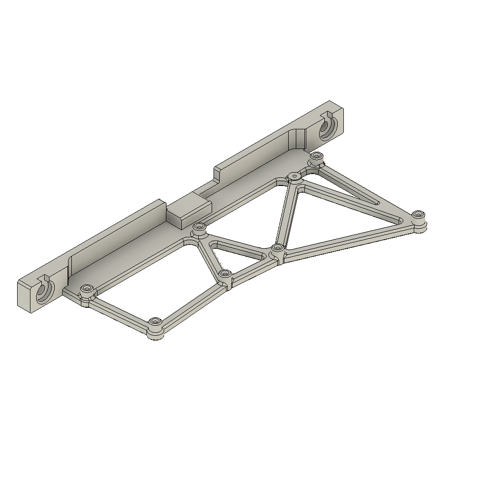  
This is an LDO designed mount for the FLY CDY V3 mainboard provided in the kit. It replaces the original printed part and allows for easy insertion of the SD card. 

## I/O Expander Mount
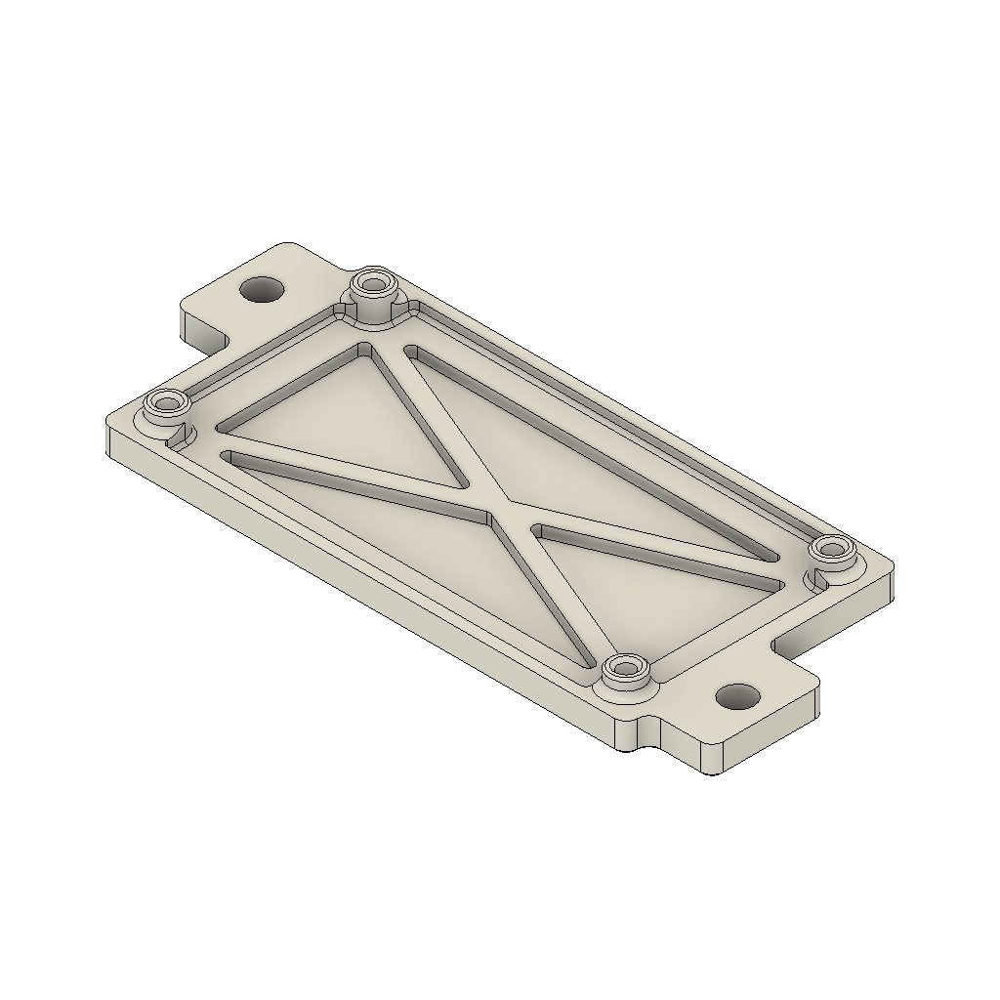  
This is a printed mount for the LDO I/O expansion board included in the kit. The expansion board allows the mainboard to control the spindle VFD.

## I/O Expander Mount (For DIN Rails)
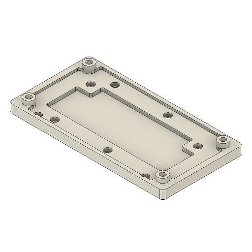  
This printed part is for the same I/O expansion board as described above, it is specifically used for mounting on DIN rails for the CASA mod.

## LMF350-UH PSU Mount
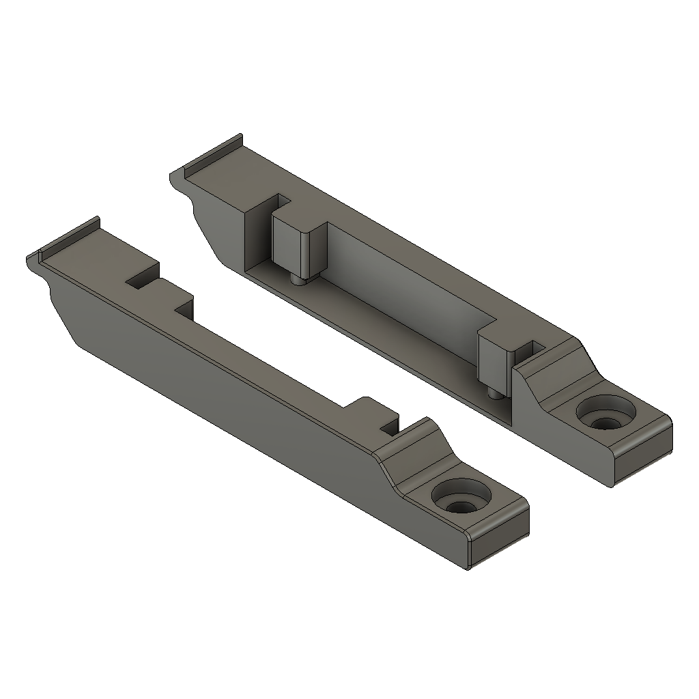  
The LMF350-UH series compact power supplied in the kit uses these mounting brackets. 

## LDO Handwheel
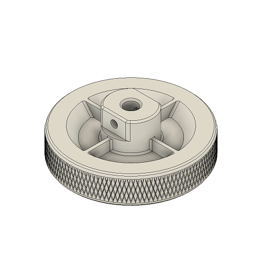  
This is an optional handle wheel design which features knurling. 

## LDO Handwheel (Smooth)
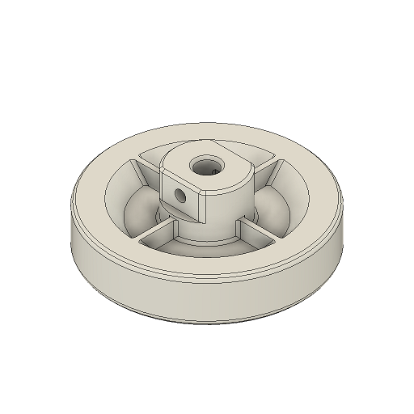  
This is the same handwheel as above but omits knurling.

## X Motor Mount
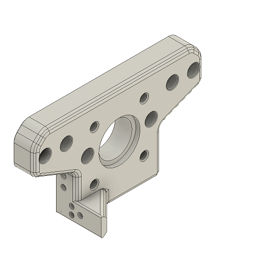  
This X Motor mount features a small tab that prevents the X drag chain from flopping.

## FMJ Z Chain Backer
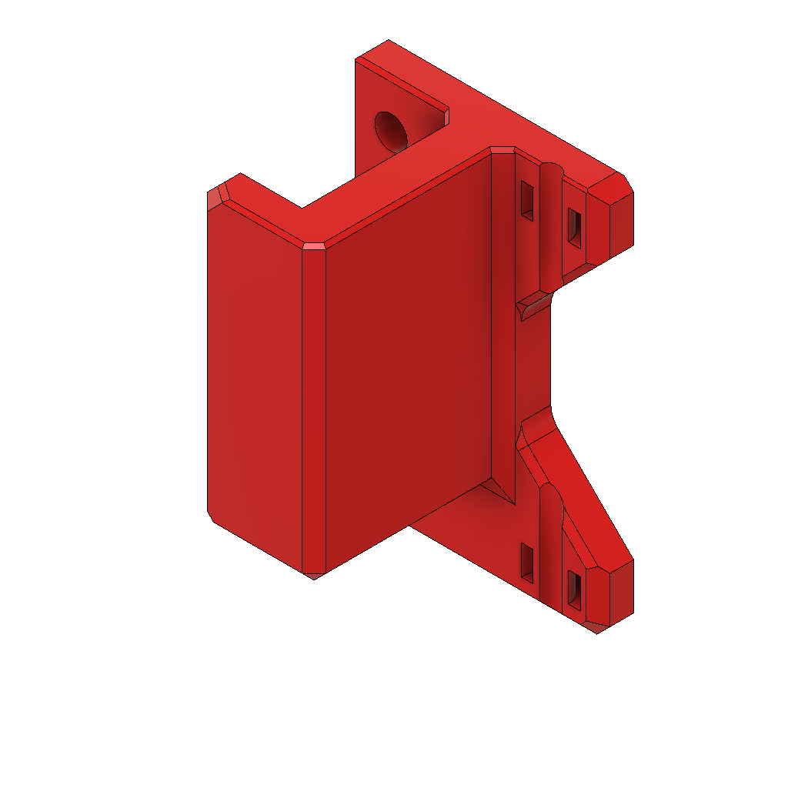  
This drag chain backer mounts on the FMJ plate. It also features anchor points for cable ties.

## Z Drag Chain Mount B
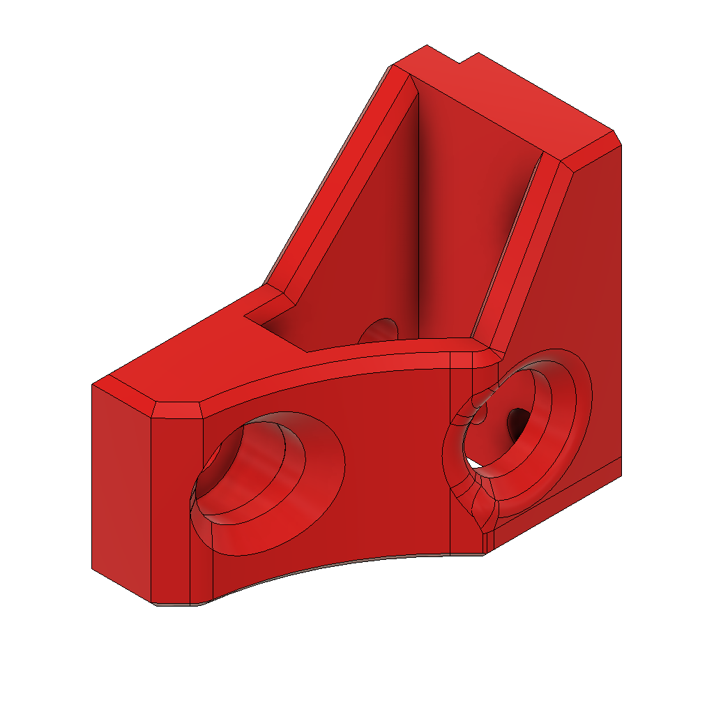  
This drag chain mount replaces the original Z Drag Chain Mount B, it helps prevent flopping.

## Z Top Cable Tie Anchor
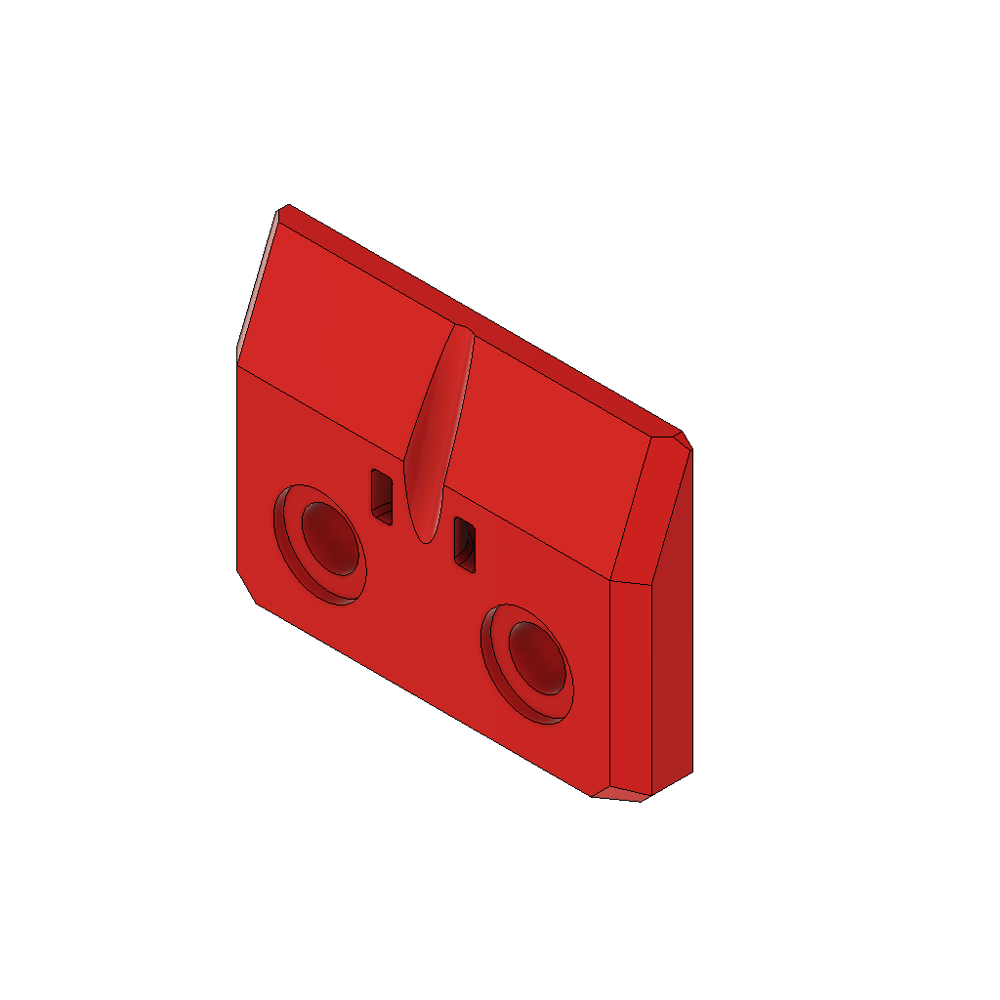  
This optional printed part adds a cable tie anchor at the top of the main column.

## Rear Cable Cover
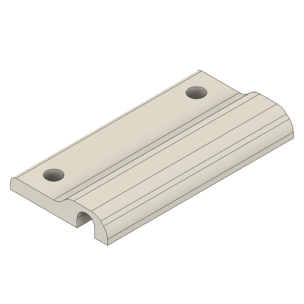  
This optional printed part helps hold down the X and Y cables onto the electronics table.